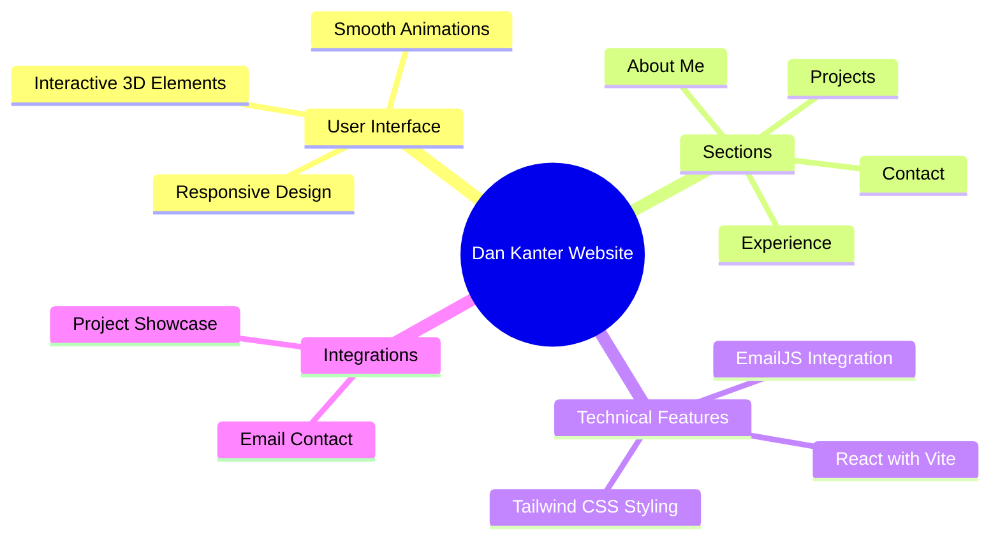

<div align="center">


<p align="center">
  <a href="#features">Features</a> •
  <a href="#demo">Demo</a> •
  <a href="#screenshots">Screenshots</a> •
  <a href="#installation">Installation</a> •
  <a href="#tech-stack">Tech Stack</a>
</p>

[](LICENSE)
[](https://dankanter.com)
[](https://reactjs.org)

<p align="center">A modern, responsive personal website showcasing professional experience, projects, and skills. Built with React, Vite, and Tailwind CSS, featuring smooth animations and interactive 3D elements. ✨</p>

</div>

## ✨ Features

<div align="center">



</div>

## 🚀 Demo

Experience the live website at [https://dankanter.com](https://dankanter.com)

## 🌐 GitHub Pages

The site deploys on every push to `main`. **One-time setup (no branch to choose):**

1. In the repo: **Settings → Pages** (under "Code and automation")
2. Under **Build and deployment**, set **Source** to **GitHub Actions**
3. That’s it. Push to `main` to trigger a deploy. The site will be at `https://itzik2sh.github.io/DanKanter-Website/`

## 🛠️ Installation

1️⃣ Clone the repository:

```bash
git clone https://github.com/dkgodin/DanKanter-Website.git
```

2️⃣ Navigate to project directory:

```bash
cd dan-kanter-website
```

3️⃣ Install dependencies:

```bash
npm install
```

4️⃣ Run development server:

```bash
npm run dev
```

5️⃣ Open in browser:

- Visit [http://localhost:3000](http://localhost:3000)

## 💻 Tech Stack

<table align="center">
  <tr>
    <td align="center" width="96">
      
      <br>React
    </td>
      <td align="center" width="96">
      
      <br>Vite
    </td>
    <td align="center" width="96">
      
      <br>Tailwind CSS
    </td>
      <td align="center" width="96">
      
      <br>Three.js
    </td>
  </tr>
</table>

## ⚡ Core Features

- 📱 Responsive Design

  - Mobile-first approach
  - Seamless experience across all devices
  - Adaptive layouts and components

- 🎯 Dynamic Content

  - Interactive project showcase
  - Engaging experience section
  - Animated skill representations

- 🎨 Modern UI/UX

  - Smooth Framer Motion animations
  - Intuitive navigation
  - Clean and professional design
  - Interactive 3D elements using Three.js

- ✉️ Email Integration
  - Contact form using EmailJS
 
## Developed by Itzik Shabtay

## 📄 License

<div align="center">

MIT License © [Dan Kanter](LICENSE)


</div>
